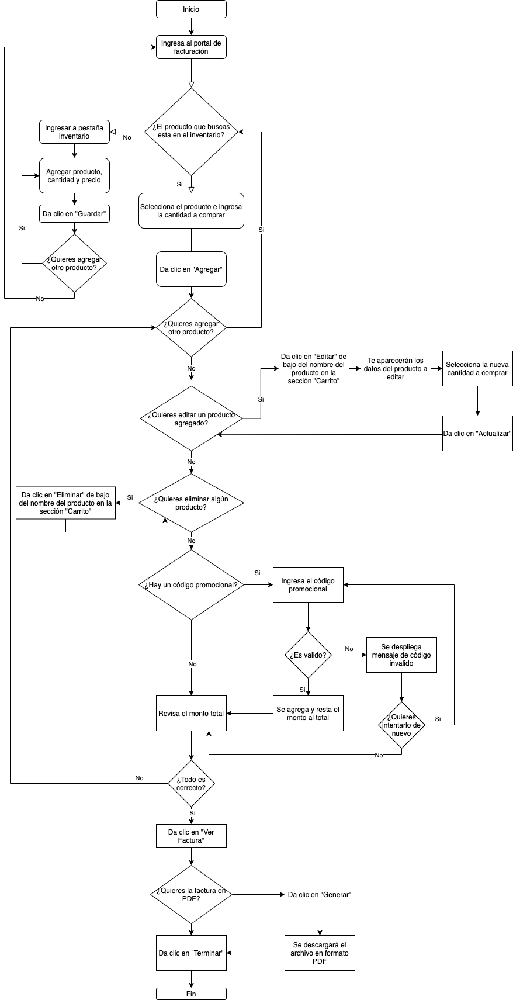

# Generador de facturas

Solución de prueba técnica de Platzi Master. Desarrollado con Python 3.9.7 y Bootstrap.

## Deploy

El deploy se realizo en pythonanywhere y se puede ingresar desde este enlace: [http://davidaamm.pythonanywhere.com/](http://davidaamm.pythonanywhere.com/).

## Descarga

La descarga se puede realizar desde consola con el siguiente comando:

    git clone https://github.com/davidaamm/factura.git

El proyecto requiere librerias, las cuales, se pueden instalar con el siguiente comando: 
    
    pip install requeriments.txt

Las versiones de las librerías que se utilizaron son las siguienes:

    Flask==2.0.2
    Flask-MySQL==1.5.2
    pdfkit==0.6.1

## Diagrama

Agrego el diagrama de flujo para el uso de la plataforma:

